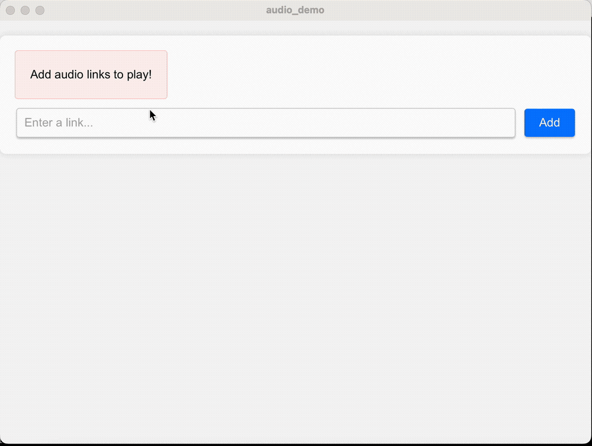

# Tauri audio application demo
Tauri application that can stream audio from several sources simultaneosly.


# Try it out!

1. Install [Rust](https://rustup.rs/)
2. Install tauri cli:
```bash
cargo install tauri-cli
```
3. Run the application:
```bash
cargo tauri dev
```